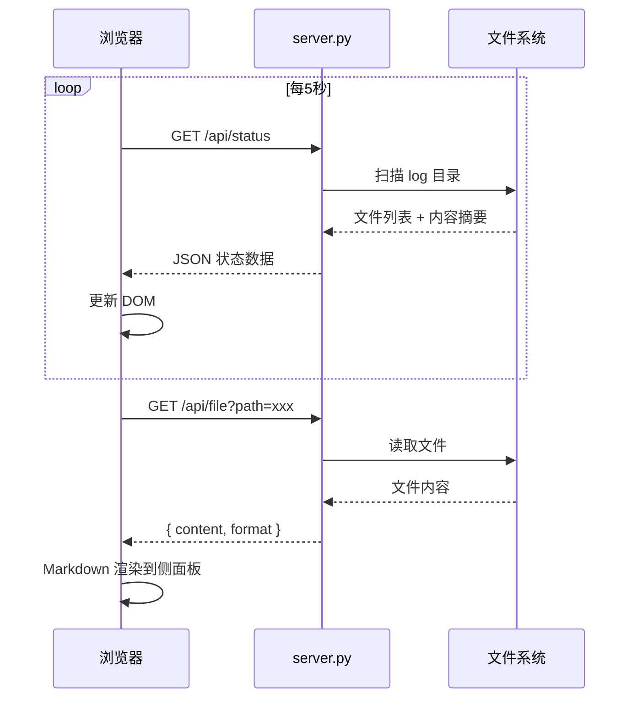

# 流水线可视化 Dashboard 系统设计

## 1. 背景与目标

### 1.1 业务背景

ai-coding-agents 流水线包含 8 个 Phase（P1-P8），每次执行产生大量 Markdown 日志文件。当前缺少直观手段查看执行进度、Agent 输入输出及评审状态。需要一个零依赖的本地 Dashboard，扫描 log 目录实时展示流水线运行状况。

### 1.2 设计目标

1. 可视化 8 Phase 流程（含 P4/P6 并行分支和修正循环）
2. 实时展示每个 Agent 的输入/输出摘要及执行状态
3. 零外部依赖，一条命令启动
4. 简洁白色视觉风格

### 1.3 术语表

| 术语 | 说明 |
|------|------|
| Phase | 流水线阶段，P1-P8 |
| Agent | 执行某 Phase 的 AI 子代理 |
| 修正循环 | P4/P6 评审失败后的迭代修复过程 |
| 判定行 | 评审报告中 `## 判定：PASS/FAIL` 标记 |

## 2. 整体方案

### 2.1 架构图

```
┌─────────────────────────────────────────────────────┐
│                   浏览器 (前端)                        │
│  index.html + style.css + app.js + md-parser.js     │
│                                                     │
│  ┌──────────┐  ┌──────────┐  ┌──────────────────┐  │
│  │流程图组件 │  │Agent面板 │  │文件查看器(侧面板)│  │
│  └──────────┘  └──────────┘  └──────────────────┘  │
└─────────────────────────┬───────────────────────────┘
                          │ HTTP (每5秒轮询)
                          ▼
┌─────────────────────────────────────────────────────┐
│              Python 后端 (server.py)                  │
│                                                     │
│  GET /api/status  → 扫描 log 目录返回 JSON          │
│  GET /api/file    → 读取指定文件内容                 │
│  GET /            → 返回前端静态文件                  │
└─────────────────────────────────────────────────────┘
                          │
                          ▼
┌─────────────────────────────────────────────────────┐
│        .ai-coding/{需求名称}/log/ 目录               │
│        (Markdown 日志文件)                           │
└─────────────────────────────────────────────────────┘
```

### 2.2 文件结构

```
dashboard/
├── server.py          # Python 后端（标准库 http.server）
├── index.html         # 单页应用主页面
├── style.css          # 样式
├── app.js             # 主逻辑（轮询、渲染、交互）
└── md-parser.js       # Markdown 解析器（纯 JS 手写）
```

### 2.3 核心流程（时序图）



## 3. 详细设计

### 3.1 后端接口设计

#### GET /api/status

- **Path**: GET /api/status
- **Auth**: 无（本地服务）
- **幂等**: 是（只读）
- **关联需求**: R01, R03, R04, R05, R06, R07, R08
- **Request**: 无参数（扫描默认目录）
- **Response**:

```json
{
  "requirement_name": "流水线可视化Dashboard",
  "requirement_dir": ".ai-coding/流水线可视化Dashboard",
  "last_scan_time": "2026-05-01T11:30:00",
  "phases": [
    {
      "id": "P1",
      "name": "需求澄清",
      "agent": "interviewer",
      "status": "pass|running|pending|fail|iterating",
      "log_file": "log/phase1-需求澄清.md",
      "output_files": ["需求清单.md"],
      "input_files": [],
      "design_principles": ["需求驱动全流程"],
      "summary": "从 log 首行或特定标记提取的摘要",
      "parallel": false
    },
    {
      "id": "P4",
      "name": "系分评审",
      "status": "pass",
      "parallel": true,
      "iteration_count": 1,
      "max_iteration": 3,
      "agents": [
        {
          "role": "design-reviewer",
          "perspective": "架构合理性",
          "status": "pass",
          "log_file": "log/phase4-评审-架构.md",
          "verdict": "PASS",
          "stats": { "critical": 0, "high": 0, "medium": 1, "low": 2 }
        }
      ],
      "iterations": [
        { "round": 1, "log_file": "log/phase4-迭代-1.md", "result": "PASS" }
      ],
      "design_principles": ["Resume优于新建", "经验库累积"]
    }
  ],
  "agent_registry": [],
  "timeline": [],
  "output_files": []
}
```

- **Error**: `{"error": "message"}` HTTP 500

#### GET /api/file

- **Path**: GET /api/file?path={relative_path}
- **Auth**: 无（本地服务）
- **幂等**: 是（只读）
- **关联需求**: R09, R10
- **Request**: `path` 查询参数，相对于项目根目录
- **Response**:

```json
{
  "path": ".ai-coding/流水线可视化Dashboard/需求清单.md",
  "content": "# 需求确认清单\n...",
  "format": "markdown"
}
```

- **安全约束**: 路径必须以 `.ai-coding/` 开头，禁止 `..` 遍历
- **Error**: `{"error": "file not found"}` HTTP 404

#### GET / (静态文件)

- **Path**: GET /{filename}
- **说明**: 返回 dashboard/ 下的 HTML/CSS/JS 文件
- **关联需求**: NFR02

### 3.2 后端 Log 扫描逻辑

`server.py` 核心扫描逻辑：

```python
# 伪代码
class LogScanner:
    def __init__(self, base_dir):
        self.base_dir = base_dir  # .ai-coding/{需求名称}
        self.log_dir = base_dir / "log"

    def scan(self) -> dict:
        """扫描所有已知文件模式，构建 phases 数组"""
        phases = []
        phases.append(self._scan_single_phase("P1", "需求澄清", "phase1-需求澄清.md", ...))
        phases.append(self._scan_single_phase("P2", "知识采集", "phase2-知识采集.md", ...))
        phases.append(self._scan_single_phase("P3", "系分编写", "phase3-系分编写.md", ...))
        phases.append(self._scan_parallel_phase("P4", "系分评审", [...reviewers...]))
        phases.append(self._scan_single_phase("P5", "编码", "phase5-编码.md", ...))
        phases.append(self._scan_parallel_phase("P6", "代码评审", [...reviewers...]))
        phases.append(self._scan_single_phase("P7", "测试", "phase7-测试.md", ...))
        phases.append(self._scan_single_phase("P8", "交付", None, ...))
        return { "phases": phases, ... }

    def _determine_status(self, log_path, is_review=False) -> str:
        """状态判断规则"""
        if not log_path.exists():
            return "pending"
        content = log_path.read_text()
        if is_review:
            if "## 判定：PASS" in content:
                return "pass"
            if "## 判定：FAIL" in content:
                return "fail"
        # 检查完成标记
        if "## 完成" in content or "完成时间" in content:
            return "pass"
        return "running"

    def _extract_summary(self, content: str) -> str:
        """从文件首段或标题后第一行提取摘要（≤100字）"""
        ...

    def _count_iterations(self, phase_prefix: str) -> list:
        """扫描 phase{N}-迭代-{M}.md 文件"""
        ...
```

**状态判断优先级**：
1. 文件不存在 → `pending`
2. 评审文件含 `## 判定：PASS` → `pass`
3. 评审文件含 `## 判定：FAIL` → `fail`
4. 存在迭代文件且最新迭代无 PASS → `iterating`
5. 文件存在但无完成标记 → `running`
6. 文件含完成标记 → `pass`

**Agent 注册表解析**：从 `执行日志.md` 的 `## Agent 注册表` 下解析 Markdown 表格行。

**时间线解析**：匹配 `- YYMMDD HHmm` 格式行。

### 3.3 后端启动方式

```bash
python server.py
# 默认端口 8080，自动检测 .ai-coding/ 下第一个需求目录
# 可选参数: python server.py --port 9000 --dir .ai-coding/流水线可视化Dashboard
```

使用 `http.server` 标准库模块，注册自定义 Handler 处理 `/api/*` 路径。

## 4. 前端设计

### 4.1 页面布局

```
┌─────────────────────────────────────────────────────────────┐
│ 顶部栏: 项目名称 | 最后扫描时间 | 需求选择器(R06按需求隔离) │
├───────────────────────────────────────┬─────────────────────┤
│                                       │                     │
│          流程图区域 (主视图)            │   侧面板            │
│                                       │   (文件查看器)      │
│  P1 → P2 → P3 → P4 → P5 → P6 → P7 → P8   │                     │
│              ├─架构──┤       ├─质量──┤ │   Markdown 渲染     │
│              ├─性能──┤       ├─安全──┤ │                     │
│              ├─需求──┤       ├─需求──┤ │                     │
│              └─循环──┘       └─循环──┘ │                     │
│                                       │                     │
├───────────────────────────────────────┤                     │
│          Agent 详情面板 (下方)          │                     │
│  输入文件 | 输出文件 | 状态 | 摘要      │                     │
└───────────────────────────────────────┴─────────────────────┘
```

### 4.2 组件划分

| 组件 | 文件位置 | 职责 |
|------|---------|------|
| PipelineGraph | app.js | 绘制 8 Phase 流程图（SVG） |
| PhaseNode | app.js | 单个 Phase 节点（含状态色） |
| ParallelGroup | app.js | P4/P6 并行分支展示 |
| IterationLoop | app.js | 修正循环箭头 |
| AgentDetailPanel | app.js | 展示选中 Phase 的 Agent IO |
| FileViewer | app.js | 侧面板文件查看器 |
| MarkdownRenderer | md-parser.js | 手写 MD 解析 + 渲染 |
| StatusBadge | app.js | 状态标识小组件 |
| DesignPrincipleTooltip | app.js | 鼠标悬浮显示设计理念 |

### 4.3 数据流

```
轮询 → fetch('/api/status') → JSON
  → 更新全局 state 对象
  → diff 对比前次 state
  → 仅更新变化的 DOM 节点
```

**全局状态结构**（app.js 内）:

```javascript
const state = {
  data: null,        // 最近一次 API 返回
  prevData: null,    // 上一次数据（用于 diff）
  selectedPhase: null, // 当前选中的 Phase
  fileViewerOpen: false,
  fileViewerContent: null
};
```

## 5. 流程图组件设计

### 5.1 渲染方案

使用 SVG 绘制流程图（纯 DOM 操作，不依赖 Canvas）：

- 每个 Phase 节点为一个 `<g>` 组，包含圆角矩形 + 文字 + 状态指示器
- 连线使用 `<path>` 元素，标注传递文档名
- P4/P6 并行分支使用分叉路径

### 5.2 布局算法

```
水平主轴: P1 → P2 → P3 → P4 → P5 → P6 → P7 → P8
          固定间距 160px

P4/P6 并行展开:
  ┌─ reviewer-1 (y-offset: -60)
  ├─ reviewer-2 (y-offset: 0)
  └─ reviewer-3 (y-offset: +60)

修正循环: 从并行组底部画弧线回到 P3/P5 入口
```

**节点尺寸**: 120×60px
**画布**: 1400×400px（可滚动）

### 5.3 状态颜色映射

| 状态 | 颜色 | 边框 |
|------|------|------|
| pending | #F5F5F5 (浅灰) | #E0E0E0 |
| running | #E3F2FD (浅蓝) | #2196F3 |
| pass | #E8F5E9 (浅绿) | #4CAF50 |
| fail | #FFEBEE (浅红) | #F44336 |
| iterating | #FFF3E0 (浅橙) | #FF9800 |

### 5.4 连线标注

Phase 间连线上方标注传递的文档名（体现"文档驱动交接"原则）：

- P1→P2: "需求清单.md"
- P2→P3: "代码阅读报告 + 知识摘要"
- P3→P4: "系分文档 + 追踪矩阵"
- P4→P5: "系分文档(已审)"
- P5→P6: "代码"
- P6→P7: "代码(已审)"
- P7→P8: "测试报告"

### 5.5 交互

- 点击节点 → 下方 AgentDetailPanel 展示该 Phase 详情
- 悬浮节点 → Tooltip 显示关联的设计理念
- 并行节点可展开/折叠

## 6. Agent IO 展示设计

### 6.1 AgentDetailPanel 布局

点击某 Phase 节点后，下方面板展示：

```
┌──────────────────────────────────────────────────────┐
│  P3 系分编写 - designer                    [运行中 🔄] │
├───────────────┬──────────────────────────────────────┤
│ 输入文件       │ 输出文件                              │
│ • 需求清单.md  │ • 系分文档.md                         │
│ • 代码阅读报告 │ • 需求追踪矩阵.md                     │
│ • 知识摘要.md  │                                      │
├───────────────┴──────────────────────────────────────┤
│ 摘要: 12条功能需求 + 4条非功能需求的系统设计...         │
├──────────────────────────────────────────────────────┤
│ 设计理念: 文档驱动交接 | 扩展优于硬编码                 │
└──────────────────────────────────────────────────────┘
```

### 6.2 并行 Agent 布局（P4/P6）

三个 reviewer 并排显示：

```
┌─────────────────┬─────────────────┬─────────────────┐
│ 架构合理性       │ 性能容量         │ 需求完整度       │
│ design-reviewer │ perf-reviewer   │ req-reviewer    │
│ [PASS ✓]        │ [PASS ✓]        │ [FAIL ✗]       │
│ C:0 H:0 M:1 L:2│ C:0 H:0 M:0 L:1│ C:1 H:0 M:0 L:0│
├─────────────────┴─────────────────┴─────────────────┤
│ 修正循环: 第1轮 → PASS                                │
└─────────────────────────────────────────────────────┘
```

### 6.3 文件链接交互

- 输入/输出文件名为可点击链接
- 点击 → 打开右侧 FileViewer 侧面板
- 调用 `GET /api/file?path=...` 获取内容

## 7. 状态更新机制

### 7.1 轮询逻辑

```javascript
// app.js
let pollTimer = null;

function startPolling() {
  pollTimer = setInterval(async () => {
    const res = await fetch('/api/status');
    const data = await res.json();
    updateState(data);
  }, 5000);
}

function updateState(newData) {
  state.prevData = state.data;
  state.data = newData;
  renderDiff();
}
```

### 7.2 增量更新策略

不重建整个 DOM，仅更新变化部分：

1. 对比 `state.data.phases[i].status` 与 `state.prevData.phases[i].status`
2. 状态变化时更新对应节点的 CSS class 和颜色
3. 新增迭代时追加迭代条目
4. summary 变化时更新文本内容

### 7.3 首次加载

页面加载时立即请求一次 `/api/status`，不等 5 秒间隔。

## 8. 文件查看器设计

### 8.1 交互流程

1. 用户点击文件链接
2. 右侧滑出侧面板（宽度 50%，CSS transition）
3. 请求 `GET /api/file?path=...`
4. 使用 md-parser.js 渲染 Markdown
5. 点击面板外部或关闭按钮收起

### 8.2 Markdown 解析器（md-parser.js）

纯 JS 手写，支持以下语法：

| 语法 | 实现方式 |
|------|---------|
| `# 标题` (1-6级) | 正则匹配行首 `#{1,6}` → `<h1>`-`<h6>` |
| `**粗体**` | 替换为 `<strong>` |
| `*斜体*` | 替换为 `<em>` |
| `` `代码` `` | 替换为 `<code>` |
| ```` ``` 代码块 ``` ```` | 状态机识别 → `<pre><code>` |
| `- 列表` | 连续行聚合 → `<ul><li>` |
| `| 表格 |` | 解析 `|` 分隔 → `<table>` |
| `[链接](url)` | 替换为 `<a>` |
| 空行 | 段落分隔 `<p>` |

**实现约束**：
- 单次遍历，逐行处理
- 代码块内不做任何解析
- 不支持嵌套列表（简化实现）

### 8.3 面板样式

- 白底，左侧 1px 分割线
- 顶部显示文件路径 + 关闭按钮
- 内容区 overflow-y: auto 可滚动
- 代码块浅灰背景 + 等宽字体

## 9. 默认模式设计

### 9.1 无数据时展示

当 `/api/status` 返回空数据或所有 Phase 状态为 `pending` 时，切换为"设计理念模式"：

- 流程图仍然展示完整的 P1-P8 结构（灰色节点）
- 每个节点内显示对应的设计理念说明
- 下方面板展示流水线整体设计思想

### 9.2 静态内容

```
┌───────────────────────────────────────────────────────────┐
│  ai-coding-agents 流水线可视化                              │
│  当前无运行数据，展示设计理念模式                             │
├───────────────────────────────────────────────────────────┤
│  P1 需求澄清          "需求驱动全流程 — 需求清单贯穿8 Phase" │
│  P2 知识采集          "GitNexus赋能 — 代码分析用知识图谱"    │
│  P3 系分编写          "文档驱动交接 — Phase间通过文档传递"    │
│  P4 系分评审          "Resume优于新建 — 修正循环复用Agent"   │
│  P5 编码             "扩展优于硬编码 — EXTENSION_DOCS挂载"  │
│  P6 代码评审          "经验库累积 — 修正中沉淀可复用模式"     │
│  P7 测试             "GitNexus赋能 — 影响面分析"           │
│  P8 交付             "主Agent纯调度 — 不执行、只决策和路由"  │
└───────────────────────────────────────────────────────────┘
```

### 9.3 切换逻辑

- 有数据 → 正常模式（实时数据）
- 无数据 → 设计理念模式（静态说明）
- 切换无需刷新，DOM 级别切换 class

## 10. 设计理念融入方案

8 大设计原则不作为独立板块，而是融入各 UI 元素：

| # | 原则 | 体现位置 | UI 实现 |
|---|------|---------|---------|
| 1 | 主Agent纯调度 | P8 节点 tooltip | 悬浮显示"主Agent唯一直接产出" |
| 2 | 需求驱动全流程 | 每个 Phase 输入列表 | 标注"需求清单"贯穿 |
| 3 | 文档驱动交接 | 连线标注 | 线上方显示传递文档名 |
| 4 | Resume优于新建 | P4/P6 修正循环标注 | 循环箭头旁标注"Resume" |
| 5 | 经验库累积 | P4/P6 修正完成后 | 标注"→经验库" |
| 6 | 按需求隔离 | 顶部需求选择器 | 下拉切换不同需求目录 |
| 7 | GitNexus赋能 | P2/P7 节点说明 | 节点内小标签"GitNexus" |
| 8 | 扩展优于硬编码 | 各 Phase 输入列表 | 标注"扩展文档(可选)" |

## 11. 非功能设计

### 11.1 零依赖方案（NFR01）

- 前端：纯 HTML + CSS + JS，无 npm/CDN 引入
- 后端：仅 Python 标准库（`http.server`, `json`, `os`, `re`, `datetime`）
- Markdown 渲染：手写解析器，不引入 marked/showdown

### 11.2 本地可运行（NFR02）

```bash
cd dashboard/
python server.py
# 浏览器访问 http://localhost:8080
```

- 自动检测 `.ai-coding/` 目录
- 无需配置文件
- Python 3.8+ 即可运行

### 11.3 性能（NFR03）

- 5 秒轮询间隔，服务端扫描 < 100ms（文件数 < 30）
- 响应体 < 50KB（JSON 摘要，非全文）
- 前端增量 DOM 更新，无整页重绘

### 11.4 浏览器兼容性（NFR04）

- 使用 ES6 语法（const/let/arrow/template literal/async-await）
- CSS Grid + Flexbox 布局
- SVG 流程图（所有现代浏览器原生支持）
- 不使用 ES2022+ 特性（如 `?.` 可用，`structuredClone` 避免）

## 12. 风险与应对

| 风险 | 影响 | 应对 |
|------|------|------|
| log 文件编码非 UTF-8 | 解析乱码 | 读取时 `errors='replace'` |
| 文件正在写入时被扫描 | 读到不完整内容 | 摘要截取容错，不 crash |
| 大文件渲染卡顿 | FileViewer 卡顿 | 限制渲染前 500 行 + "加载更多" |
| 端口被占用 | 无法启动 | 启动时检测并提示换端口 |

## 13. 附录

### 13.1 代码阅读报告引用

本设计基于 SKILL.md 中定义的 8 Phase 流程和文件命名约定。

### 13.2 参考文档

- 知识摘要.md — 完整 JSON 结构定义
- SKILL.md — 流水线核心设计
- reference/修正循环协议.md — 迭代修正规则
