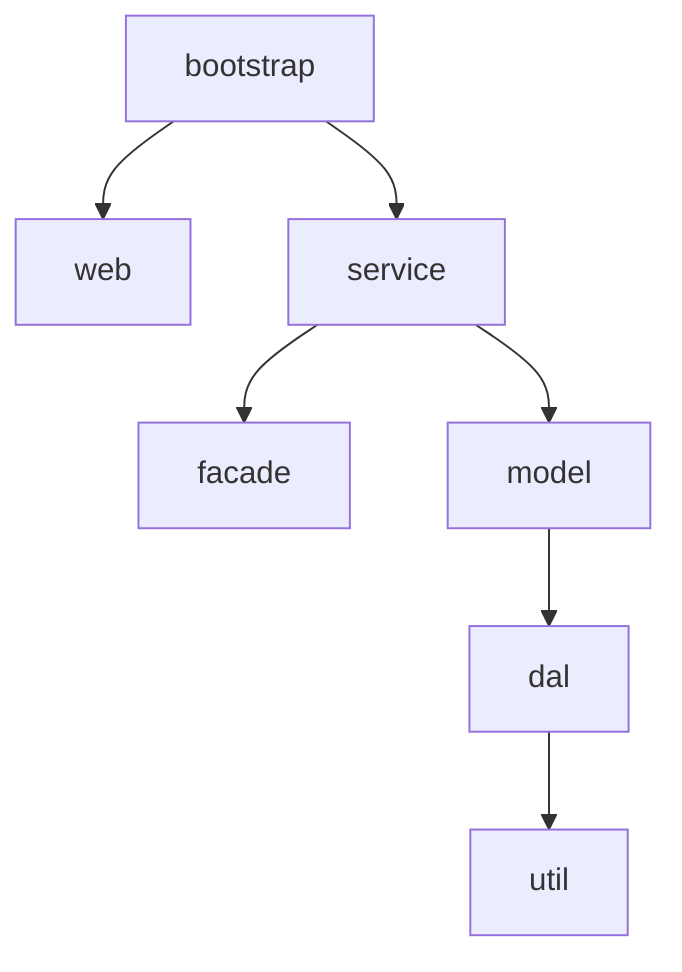
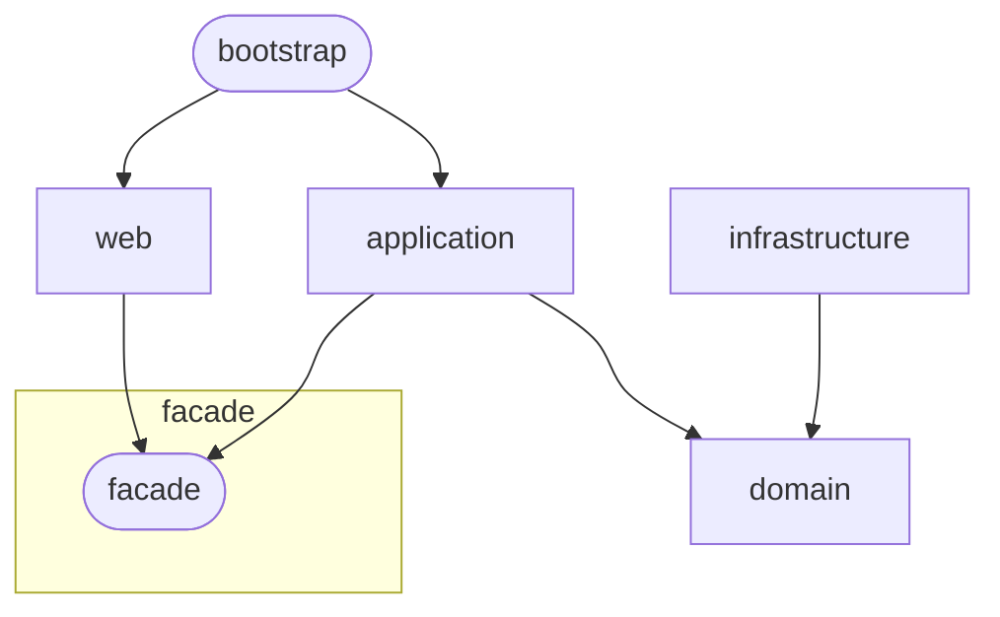

# SOFABoot 工程结构规范

## 一、工程目录结构

SOFABoot 工程中目录概览如下所示:

```plain
+-- appname
  |-- app              （应用目录）
  |-- conf             （SOFABoot 相关配置存放目录）
  |-- pom.xml          （总 POM 文件）
```

### 1. app 目录

`app` 目录是项目工程的主目录,用于放置用户编写的代码,您可以按照自己的编程习惯在该目录下编写代码。

### 2. conf 目录

`conf` 目录用于放置部署脚本、配置等运维相关文件。该目录格式内容需保持固定,**请勿随意调动和修改这些文件**。`conf` 目录结构详情如下所示:

```plain
conf/
├── bin (应用启动/健康检查相关脚本)
│   ├── healthcheck.sh
│   ├── hook.sh
│   ├── nginx.sh
│   ├── startup.sh
│   └── util.sh
└── config
    └── tenginx-conf (Tengine 配置文件)
       └── t-alipay-tengine.conf
```

由于主站最新版本镜像已经将 `bin` 目录下的运维脚本全部内置化,最新脚手架创建的工程 `bin` 目录下去除了用户代码中的 `hook.sh` 以外的脚本文件,工程结构如下所示:

```plain
conf/
├── bin (应用启动/健康检查相关脚本)
│   └── hook.sh
└── config
    └── tenginx-conf (Tengine 配置文件)
       └── t-alipay-tengine.conf
```

**【推荐】** 如果您对运维脚本有定制需求,您可以在 `hook.sh` 文件中预留的扩展点方法中定义您的逻辑。

> **注意**: 您代码中的 `healthcheck.sh` 与 `startup.sh` 可以同时存在,也可以都不存在,但是不能只存在其中一个文件。

## 二、工程配置规范

### 2.1 配置文件目录结构

**所有 SOFABoot 应用的配置必须按照以下目录结构进行配置**:

```
bootstrap/src/main/resources/
├── application.properties          # 主配置文件(必填)
├── log4j2-spring.xml              # 日志配置文件(必填)
├── config/                        # 环境配置目录(必填)
│   ├── application.properties     # 默认环境配置
│   ├── application-default.properties  # 本地开发环境配置
│   ├── application-dev.properties      # 开发环境配置
│   ├── application-test.properties     # 测试环境配置
│   └── application-prod.properties     # 生产环境配置
├── spring/                        # Spring相关配置(可选)
└── static/                        # 静态资源目录(可选)
```

### 2.2 必须配置的文件清单

| 配置文件 | 位置 | 是否必填 | 说明 |
|----------|------|----------|------|
| `application.properties` | `config/application.properties` | **是** | 主配置文件,包含应用基础配置 |
| `log4j2-spring.xml` | `log4j2-spring.xml` | **是** | 日志配置文件,定义日志输出规则 |
| `application-default.properties` | `config/application-default.properties` | **是** | 本地开发环境配置 |
| `application-dev.properties` | `config/application-dev.properties` | 建议 | 开发环境配置 |
| `application-test.properties` | `config/application-test.properties` | 建议 | 测试环境配置 |
| `application-prod.properties` | `config/application-prod.properties` | 建议 | 生产环境配置 |

### 2.3 配置规范要求

#### 1. 主配置文件(application.properties)

**【推荐】** 必须包含以下核心配置项:

- `sofa.version` - SOFABoot版本标识(编译打包推荐校验)
- `spring.application.name` - 应用名称
- `server.port` - 服务端口号
- `logging.path` - 日志文件存储路径(编译打包推荐校验)
- `logging.config` - 日志配置文件路径

#### 2. 环境配置文件

**配置优先级**: `application-{profile}.properties` > `application.properties`

各环境配置文件用途:

| 配置文件 | 适用环境 | 用途 |
|----------|----------|------|
| `application-default.properties` | 本地开发 | 本地开发环境专属配置 |
| `application-dev.properties` | 开发环境 | 开发环境专属配置 |
| `application-test.properties` | 测试环境 | 测试环境专属配置 |
| `application-prod.properties` | 生产环境 | 生产环境专属配置 |

#### 3. 日志配置文件(log4j2-spring.xml)

**【推荐】** 必须配置的日志文件:

- `common-error.log` - 错误级别日志
- `app-default.log` - 应用默认日志
- `diagnosis-record-digest.log` - 诊断记录日志

### 2.4 配置加载顺序

Spring Boot/SOFABoot 配置加载优先级(从高到低):

1. 命令行参数
2. 来自 `SPRING_APPLICATION_JSON` 的属性
3. `ServletConfig` 初始化参数
4. `ServletContext` 初始化参数
5. JNDI 属性
6. Java 系统属性(System.getProperties())
7. 操作系统环境变量
8. `RandomValuePropertySource`
9. jar包外部的 `application-{profile}.properties`
10. jar包内部的 `application-{profile}.properties`
11. jar包外部的 `application.properties`
12. jar包内部的 `application.properties`
13. @PropertySource 注解定义的属性
14. 默认属性(SpringApplication.setDefaultProperties)

### 2.5 配置验证要求

**【推荐】** 编译打包时会推荐校验以下字段:
- `sofa.version` 必须为 SOFABoot
- `logging.path` 必须配置

## 三、工程分层结构

在创建 SOFABoot 工程时有三种可选的分层结构,您可以根据自身的需求选择某种分层结构,也可以在生成 SOFABoot 工程后自行调整分层结构。

- **MVC 分层**: 传统三层模型的分层模型,适合复杂度较低的应用使用
- **DDD 分层**: 面向领域建模的分层模型,适合基于领域驱动设计开发的应用使用
- **SOFA 分层**: 蚂蚁传统分层模型,适合习惯蚂蚁传统分层的开发同学使用

> **说明**: 下文将分别介绍三种结构。以下所有示意图中,用箭头表示模块之间的依赖关系:依赖具有传递性,假设 A 依赖 B,且 B 依赖 C ,则有 A 依赖 C。

### 3.1 MVC 分层

MVC 分层是基于传统的 MVC 三层架构思想的分层模型,可以将各层实现的功能区分开来:

- **M(Model)模型层**: 与数据库交互的数据模型,负责进行数据相关操作
- **V(View)视图层**: 与用户交互的数据区,负责收集展示数据
- **C(Controller)控制层**: 负责接收数据和逻辑处理。控制层收到请求后,会调用模型层与数据库交互获取数据,最后将数据返回给视图层

MVC 模型还包括 **D(Dao)数据访问层**: 与数据库建立连接,负责数据的增删改查。

MVC 分层对应的模块依赖关系如下图所示:



#### bootstrap 层(启动层-MVC)

该层是 SOFABoot 项目中的启动模块,其中包含 SOFABoot 应用的启动类、配置文件、打包插件等,其测试目录中还提供了集成测试的基类,可支持继承和扩展。

该模块可通过直接或间接依赖引用其他各模块的代码。

#### web 层(UI 层)

web 层是应用的视图展现层(可选,如果应用不需要提供 web 服务,可以去掉这一层)。web 层被 bootstrap 层依赖,并依赖 service 层以实现具体的业务逻辑。

#### facade 层(外观层-MVC)

facade 层是应用对外提供的接口层(可选,如果不需要对外提供服务,可以去掉这一层),用于提供接口描述文件(如 service, DTO),不包含任何业务逻辑。该模块使用单独的版本号,需要单独发布打包。

#### service 层(服务层)

service 层作为 web 层或 facade 层与 model 层之间的桥梁,是实现主要业务逻辑的模块(如提供访问数据库之前的数据校验,处理数据库返回的值,发布 RPC 服务等)。

#### model 层(模型层)

model 层用于存放实体类,即定义业务逻辑的领域对象。

#### dal 层(数据库层)

dal 层主要是用于访问数据库,即编写对数据库的增删改查的 sql 语句实现。

#### utils 层(工具层)

utils 层提供了一些公共的工具库类,这些类可以被应用中的所有类使用。

### 3.2 DDD 分层

DDD 分层是基于领域驱动设计思想设计的分层结构,在 DDD 的经典四层分层架构之上进行了改良,采用依赖倒置的方式解决领域层与基础设施层的相互依赖问题,使其更加符合经典的六边形架构。

DDD 分层对应的模块依赖关系如下图所示:



#### bootstrap 层(启动层-DDD)

该层是 SOFABoot 项目中的启动模块,其中包含 SOFABoot 应用的启动类、配置文件、打包插件等,其测试目录中还提供了集成测试的基类,可支持继承和扩展。

该模块可通过直接或间接依赖引用其他各模块的代码。

#### web 层(展现层)

web 层是应用的视图展现层(可选,如果应用不需要提供 web 服务,可以去掉这一层)。web 层被 bootstrap 层依赖,并依赖 application 层实现具体的业务逻辑。

#### facade 层(外观层-DDD)

facade 层是应用对外提供的接口层(可选,如果不需要对外提供服务,可以去掉这一层),用于提供接口描述文件(如 service, DTO),不包含任何业务逻辑。该模块使用单独的版本号,需要单独发布打包。

#### application 层(应用层)

application 层为领域驱动设计中的应用层,位于领域层之上,可以调用领域服务、使用领域模型。该层更专注于具体应用所需要的逻辑处理,为领域层需要协作的各个领域服务协调任务、委派工作而不包含核心业务规则。当存在 facade 层时,application 层依赖 facade 层,提供 facade 层接口的具体实现逻辑。

#### domain 层(核心领域层)

domain 层为领域驱动设计中的领域层,该层定义了领域模型并使用领域模型提供了核心领域服务(以 service 结尾命名)。领域层是业务的核心,不依赖其他模块,从而保证核心系统对外部系统的解耦。

**【推荐】** 若需在 domain 层查询数据库或者调用第三方 tr 服务(数据库和 tr 代理类在 Infrastructure 层),只需在 domain 层定义一个接口用以注入实现类,在 infrastructure 层实现调用即可。

#### infrastructure 层(基础设施层)

infrastructure 层为系统提供了各类基础设施,包含 RPC、Message、DB、Cache 等三方系统的依赖,流程引擎、规则引擎等 service 层可能用到的编排工具。infrastructure 层依赖 domain 层但不被 domain 层直接依赖,通常通过**依赖反转**的方式提供 domain 层中领域服务的具体实现。

### 3.3 SOFA 分层

SOFA 分层是沿袭自蚂蚁 SOFA 工程的传统分层模型,解决了开发时各模块相互影响的问题。

#### test 层(测试层)

该层是 SOFABoot 项目中的测试模块,为应用提供了单元测试的基类,支持继承和扩展功能。test 层位于 SOFABoot 系统最顶端,可以通过直接和间接依赖访问到每个模块的代码,即所有模块对测试层都是可见的。

#### bootstrap 层(启动层-SOFA)

该层是 SOFABoot 项目中的启动模块,其中包含 SOFABoot 应用的启动类、配置文件、打包插件等。该层通过直接和间接依赖,可以访问到除测试模块外每个模块的代码。

#### web 层(展现层)

web 层是应用的视图展现层,该层是可选的,如果只开发纯业务的核心系统,可以去掉这一层。SOFA MVC 专门为 web 层提供了强大的 MVC 框架。

**web-home**

`web-home` 是 web 层中的公用 web 模块,它包含了运行视图层需要的所有公共组件的配置,是 SOFA MVC 能正常运行的基础。该模块中可以放一些全局的处理逻辑,例如首页访问请求处理、全局错误处理等。

**web-prod**

`web-prod1`、`web-prod2` 是可选的 web 模块,您可以根据需要创建,用于处理不同模块的页面请求。这些模块之间是同级的,不存在互相依赖关系,在开发中也**不要手动建立 web 层各模块间的依赖**,否则会造成业务逻辑的混乱或形成循环依赖。所有公共的页面处理逻辑都需要放到 web-home 里,所有 web 模块都依赖 web-home ,且通过它间接依赖 biz、core 和 common 层。

#### biz 层(业务应用层)

**是否引入领域层对 biz 层的影响**

- 未引入领域层: biz 层相当于传统分层架构中的业务逻辑层,可以直接设计在 DAL 层之上,调用 DAL 提供的数据访问服务,使用 DAL 层的 DO 作为数据传输对象,在此层实现所有业务逻辑,向展现层暴露业务服务接口
- 引入领域层: biz 层相当于领域驱动设计中的应用层,位于领域层之上,可以调用领域服务、使用领域模型,此时 biz 层专注于具体应用所需要的逻辑处理而不包含核心业务规则,更多的是给领域层需要协作的各个领域服务协调任务、委派工作

**biz层的模块划分**

biz 层的模块划分与 web 层对应:

- `biz-shared` 模块与 `web-home` 对应,用于封装公用的应用逻辑
- `biz-prod1`、`biz-prod2` 分别与 Web 层的相应模块一一对应,其中包含了对应模块的业务逻辑。它们之间也不存在互相依赖关系,原因与 Web 层的相同

**biz-service-impl**

biz-service-impl 模块中封装了对外发布的服务接口的具体实现。提供给外部系统调用的服务分为两部分:

- 接口定义放在 common 层的 common-service-facade 模块,外部系统只需定义对该 facade 模块的依赖便可以 stub 的形式使用接口定义
- 接口实现放在 biz 层的 biz-service-impl 模块,该模块的业务可能会引用 biz-shared、biz-prod1、biz-prod2 等模块中的服务,因此它可以依赖 biz 层的所有模块

**模块依赖配置**

自动生成的 SOFABoot 工程只配置了 biz-service-impl 对 biz-shared 和 common-service-facade 的依赖,对其他 biz 模块的依赖需要根据实际需要手动添加。所有 biz 层模块都依赖于 biz-shared ,且通过它间接依赖 core 层和 common 层。

> **命名规范**: 该层业务服务类以 Manager 结尾,包装的门面以 Facade 结尾。

#### core 层(核心领域层)

传统的分层设计中不包含领域层,而是直接在 DAL 层之上设计 biz 业务逻辑层。而当业务发展到一定深度和成熟度、甚至可以制定行业标准时,就有必要进行领域层的设计。按照领域驱动设计的方式,在一开始就进行领域层的设计,为以后的业务扩展提供支持,也是一种良好的设计方案。

core 层分为两个模块:

- core-service 模块封装核心业务,提供核心领域服务
- core-model 模块包含领域层各个模型对象

core-service 模块被 biz 层依赖,为其提供核心领域服务,又依赖同层的 core-model ,使用其定义的模型对象,起到承上启下的作用。

> **命名规范**: 领域服务的命名以 Service 结尾。

#### common 层(基础结构层)

common 层中包含了为系统提供基础服务的各个模块:

- common-dal 模块相当于传统分层中的数据访问层,封装了对数据库的访问逻辑,向上暴露 DAO 服务。common-dal 模块位于依赖链的最底层,所有模块都会直接或间接的依赖它,使用其 DAO 服务
- util 模块则提供了基础的公用的工具服务

## 参考文档

- [SOFABoot 官方文档](https://yuque.antfin.com/middleware/sofaboot/guide-archetype-files)
- [SOFABoot Web 开发规范](./antgroup-sofaboot-web.md)